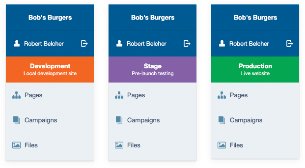

# Environment Awareness for SilverStripe

Have you ever thought you were working locally, and deleted something from the live site? Me too! I guess we don't look at the URL bar enough. This module adds a notice to the CMS and front-end to let you know which environment you are working in.

## Requirements

SilverStripe 4.5+ (^3.1 support with previous versions)

## Documentation

* [Installation](docs/en/installation.md)
* [How to use](docs/en/how-to-use.md)
* [Troubleshooting](docs/en/troubleshooting.md)
* [License](license.md)
* [Contributing](contributing.md)

## Maintainer contact

[Jono Menz](https://jonomenz.com)

## Sponsorship

If you want to boost morale of the maintainer you're welcome to make a small monthly donation through [**GitHub**](https://github.com/sponsors/jonom), or a one time donation through [**PayPal**](https://www.paypal.com/cgi-bin/webscr?cmd=_s-xclick&hosted_button_id=Z5HEZREZSKA6A). ❤️ Thank you!

Please also feel free to [get in touch](https://jonomenz.com) if you want to hire the maintainer to develop a new feature, or discuss another opportunity.
